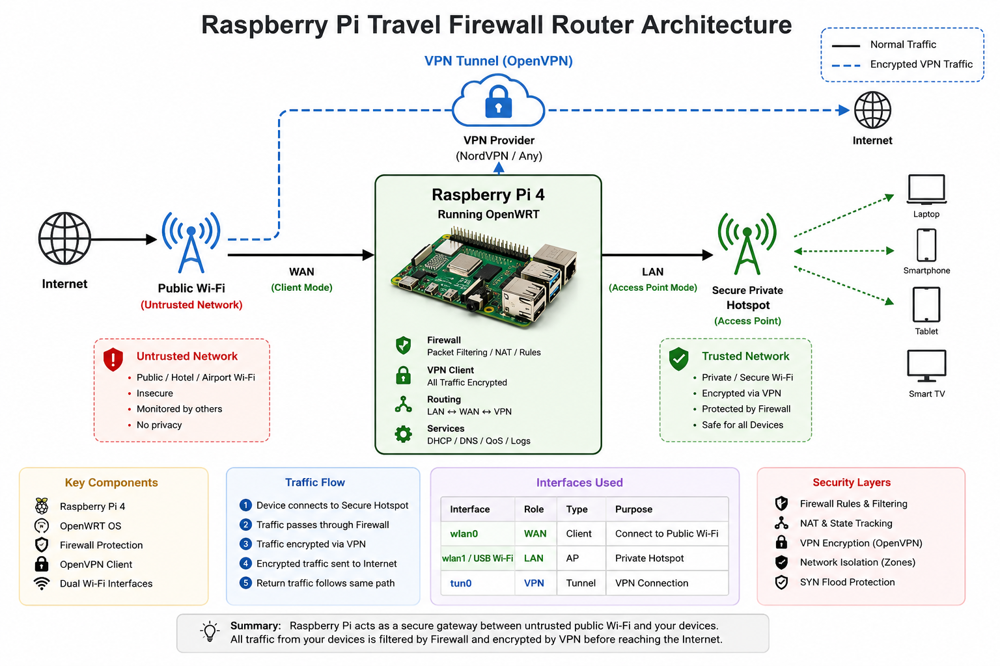
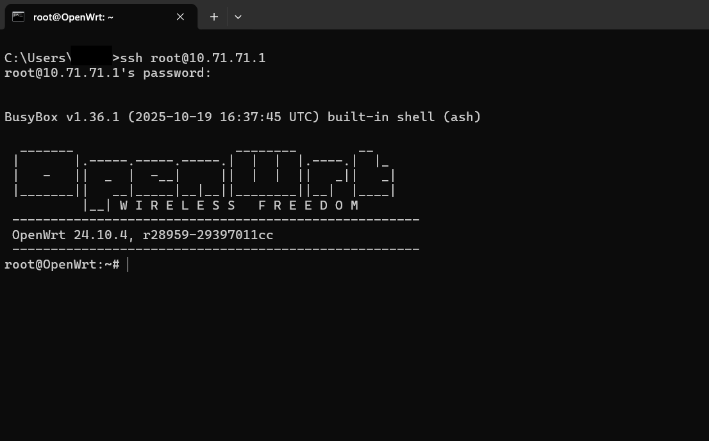
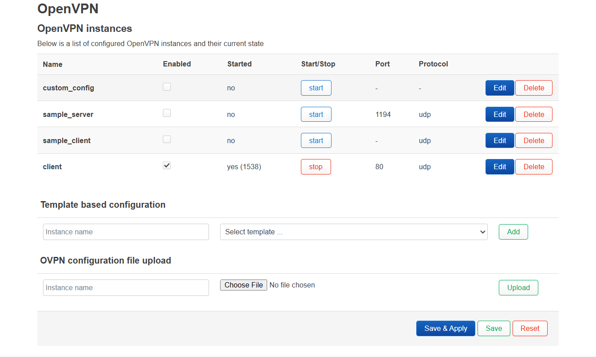

# 🛡️ Raspberry Pi Travel Firewall Router

<div align="center">

### Portable Secure Public Wi-Fi Protection Using Raspberry Pi & OpenWRT


</div>

---

# 📌 Overview

This project transforms a **Raspberry Pi** into a **portable travel firewall router** using **OpenWRT**, an open-source Linux-based router operating system.

The system is designed to provide:

* Secure internet access on public Wi-Fi
* VPN-protected browsing
* Private hotspot creation
* Firewall-based traffic filtering
* Portable cybersecurity solution for travel and public environments

The Raspberry Pi acts as a secure gateway between users and the internet by routing all traffic through firewall and VPN protection.

---

# 🧠 How It Works

The Raspberry Pi connects to a public or external Wi-Fi network using one wireless interface and simultaneously creates its own protected private hotspot using another Wi-Fi interface.

All connected devices access the internet through:

1. Firewall filtering
2. Network traffic inspection
3. VPN encryption
4. Secure routing

---

# 🌐 Network Architecture

```text
                Public Wi-Fi / Internet
                           │
                           ▼
             ┌────────────────────────┐
             │ Raspberry Pi Firewall  │
             │        OpenWRT         │
             └────────────────────────┘
                    │            │
          WAN (Client)      VPN Tunnel
                    │            │
                    ▼            ▼
               Firewall & Traffic Filtering
                           │
                           ▼
                 Secure Private Hotspot
                           │
                           ▼
                    Connected Devices
```

<p align="center">
  
  <br>
  <b>Figure:</b> Raspberry Pi Travel Firewall Architecture
</p>

---

# ✨ Features

## 🔐 Security Features

* Packet filtering
* SYN flood protection
* Traffic inspection
* Firewall zone separation
* VPN encrypted traffic
* Secure WPA2 hotspot
* Public Wi-Fi protection

---

## 🌐 Networking Features

* Public Wi-Fi connection
* LAN/WAN routing
* DHCP support
* NAT forwarding
* OpenVPN support
* Dual Wi-Fi operation
* Secure access point creation

---

## 📊 Monitoring Features

* Firewall logs
* Network traffic monitoring
* Interface inspection
* VPN status checking
* Packet flow analysis

---

# 🛠️ Hardware Requirements

| Component                        | Description                              |
| -------------------------------- | ---------------------------------------- |
| Raspberry Pi 4                   | Recommended main device                  |
| Power Adapter                    | 5V Raspberry Pi supply                   |
| MicroSD Card                     | 16GB or higher                           |
| Ethernet Cable                   | Initial setup                            |
| USB Wi-Fi Adapter (AP Supported) | Secondary wireless interface for hotspot |
| Card Reader                      | Flash OpenWRT image                      |

---

# 💻 Software Requirements

| Software            | Purpose                 |
| ------------------- | ----------------------- |
| OpenWRT             | Router operating system |
| Raspberry Pi Imager | Flash OS image          |
| PuTTY               | SSH access              |
| WinSCP              | File transfer           |
| Git                 | Version control         |
| VS Code             | Editing configs/scripts |

---

# 📥 Downloads

## OpenWRT

https://openwrt.org

## Raspberry Pi Imager

https://www.raspberrypi.com/software/

## Git

https://git-scm.com/downloads

## PuTTY

https://www.putty.org

## WinSCP

https://winscp.net

## Visual Studio Code

https://code.visualstudio.com

---

# ⚠️ Important Repository Note

For security reasons, this repository only contains **sample configuration files**.

Do NOT upload:

* Real passwords
* VPN credentials
* Private keys
* Personal network details

Use these example files instead:

```text
configs/
├── firewall.sample
├── network.sample
├── wireless.sample
└── openvpn-client.sample
```

---

# 🚀 Setup Guide

# 1️⃣ Flash OpenWRT

1. Install Raspberry Pi Imager
2. Download OpenWRT image
3. Flash image to MicroSD card
4. Insert SD card into Raspberry Pi

---

# 2️⃣ Connect Raspberry Pi

* Connect Raspberry Pi using Ethernet
* Power on device
* Wait for boot process

Default OpenWRT IP:

```text
192.168.1.1
```

---

# 3️⃣ Configure Static IP on PC

Example static IP:

```text
192.168.1.10
```

This allows communication with OpenWRT during initial setup.

---

# 4️⃣ SSH into Raspberry Pi

```bash
ssh root@192.168.1.1
```

Default:

* Username: `root`
* Password: none

Immediately set password:

```bash
passwd
```
<p align="center">
  
  <br>
  <b>Figure:</b> Raspberry Pi Travel Firewall Architecture
</p>

---

---

# 5️⃣ Backup Important Configurations

```bash
cp /etc/config/network /etc/config/network.bk
cp /etc/config/firewall /etc/config/firewall.bk
cp /etc/config/wireless /etc/config/wireless.bk
```

---

# 6️⃣ Configure Network Interfaces

Edit network configuration:

```bash
vi /etc/config/network
```

Recommended interfaces:

| Interface | Protocol | Purpose         |
| --------- | -------- | --------------- |
| lan       | static   | Private hotspot |
| wan       | DHCP     | Public Wi-Fi    |
| vpnclient | none     | VPN tunnel      |

---

# 🌐 Example Network Configuration

Create:

```text
configs/network.sample
```

Example:

```bash
config interface 'lan'
        option proto 'static'
        option ipaddr '10.71.70.1'
        option netmask '255.255.255.0'

config interface 'wan'
        option proto 'dhcp'
```

---

# 7️⃣ Change Default LAN Subnet

Instead of:

```text
192.168.1.1
```

Use a custom subnet like:

```text
10.71.70.1
```

This reduces exposure to common attacks targeting default router IP ranges.

---

# 8️⃣ Configure Firewall

Edit firewall configuration:

```bash
vi /etc/config/firewall
```

---

# 🔥 Example Firewall Configuration

Create:

```text
configs/firewall.sample
```

Example:

```bash
config defaults
        option input 'REJECT'
        option output 'ACCEPT'
        option forward 'REJECT'
        option synflood_protect '1'
```

Restart firewall:

```bash
/etc/init.d/firewall restart
```

---

# 📡 Wireless Configuration

Edit wireless configuration:

```bash
vi /etc/config/wireless
```

---

# 📶 Example Wireless Configuration

Create:

```text
configs/wireless.sample
```

Example:

```bash
config wifi-device 'radio0'
        option type 'mac80211'
        option channel '7'
        option band '2g'
        option htmode 'HT20'
        option disabled '0'

config wifi-iface 'wanwifi'
        option device 'radio0'
        option mode 'sta'
        option network 'wan'
        option ssid 'PublicWiFi'
        option encryption 'psk2'
        option key 'YOUR_WIFI_PASSWORD'

config wifi-device 'radio1'
        option type 'mac80211'
        option channel '11'
        option band '2g'
        option htmode 'HT20'
        option disabled '0'

config wifi-iface 'lanwifi'
        option device 'radio1'
        option mode 'ap'
        option network 'lan'
        option ssid 'SecureTravelNet'
        option encryption 'psk2'
        option key 'YOUR_HOTSPOT_PASSWORD'
```

---

# 📌 Wireless Setup Explanation

| Interface | Mode              | Purpose                   |
| --------- | ----------------- | ------------------------- |
| radio0    | STA (Client)      | Connects to public Wi-Fi  |
| radio1    | AP (Access Point) | Broadcasts secure hotspot |

---

# 📡 Apply Wireless Changes

```bash
uci commit wireless
wifi reload
```

---

# 🔟 Configure USB Wi-Fi Adapter

Update packages:

```bash
opkg update
```

Install drivers:

```bash
opkg install kmod-mt7601u
```

Check adapter:

```bash
lsusb
```

Activate interface:

```bash
ifconfig wlan1 up
```

---

# 1️⃣1️⃣ Create Secure Hotspot

Configure USB Wi-Fi adapter as Access Point:

* SSID: `SecureTravelNet`
* Encryption: WPA2-PSK
* Strong password required

Location:

```text
Network → Wireless
```

---

# 1️⃣2️⃣ Connect to Public Wi-Fi

Using OpenWRT GUI:

1. Scan nearby Wi-Fi
2. Join network
3. Enter password
4. Save & Apply

---

# 🔐 VPN Integration (OpenVPN / NordVPN)

Install OpenVPN:

```bash
opkg install openvpn-openssl luci-app-openvpn
```

Upload VPN configuration:

```bash
scp client.ovpn root@192.168.1.1:/etc/openvpn/
```

Enable VPN service through OpenWRT GUI.

---

<p align="center">
  
  <br>
  <b>Figure:</b> OpenVPN / NordVPN Integration
</p>

---

# 🌍 Verify VPN Connection

Check public IP after VPN activation to confirm encrypted routing.

Useful commands:

```bash
ifconfig
ip route
ping google.com
logread
```

---

# 📂 Project Structure

```text
project/
├── configs/
│   ├── firewall.sample
│   ├── network.sample
│   ├── wireless.sample
│   └── openvpn-client.sample
├── scripts/
├── docs/
├── diagrams/
├── images/
├── README.md
└── LICENSE
```

---

# 📸 Recommended Screenshots

Include:

* OpenWRT dashboard
* Raspberry Pi hardware
* Firewall rules
* VPN configuration
* Network topology
* Wi-Fi settings

---

# ⚠️ Limitations

* Limited processing power
* Lower throughput than enterprise routers
* Requires Linux/networking knowledge
* USB Wi-Fi compatibility varies

---

# 🎯 Advantages

* Portable travel router
* Low-cost firewall solution
* VPN protection on public Wi-Fi
* Open-source customization
* Lightweight setup
* Educational cybersecurity project

---

# 📈 Future Improvements

* AI-based threat detection
* Intrusion Detection System (IDS)
* Real-time monitoring dashboard
* Advanced packet analysis
* Automatic threat blocking

---

# 🤝 Contribution

Contributions are welcome.

1. Fork repository
2. Create feature branch
3. Commit changes
4. Push updates
5. Create Pull Request

---

# 📜 License

MIT License

---

# 👨‍💻 Author

Akshay Akn

Cybersecurity Enthusiast • Developer • Open Source Learner

---

<div align="center">

### ⭐ Star this repository if you found it useful ⭐

</div>
